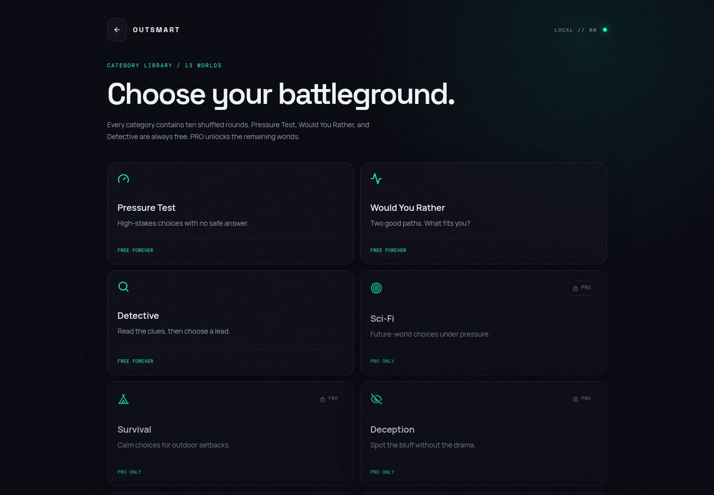

# OUTSMART

**Can you become the choice the machine cannot expect?**

OUTSMART is a behavioral prediction game created by **Densey Zenel Maben**. The player answers a sequence of two-option dilemmas while an AI model predicts each choice before the answer is revealed.

The goal is not simply to answer questions. The goal is to understand the pattern the model sees, then decide whether to follow it or break it.



## What is included

This repository contains the complete OUTSMART product:

- Responsive React web application
- Expo and React Native mobile application for iOS and Android
- Express API server
- PostgreSQL and Drizzle data layer
- Stripe subscriptions for the web
- RevenueCat subscriptions for native apps
- Shared OpenAPI contracts, generated validation schemas, and API clients
- Local behavioral model, progression, game history, and privacy controls

## How the game works

### Core session

1. A session begins with USER and AI scores at zero.
2. The player receives a two-option behavioral dilemma.
3. The model locks its prediction before the player answers.
4. The player chooses an answer.
5. The prediction is revealed with the model's confidence.
6. Exactly one side receives 100 points:
   - The AI receives 100 points when its prediction is correct.
   - The player receives 100 points when the prediction is broken.
7. The model learns from the response and prepares its next prediction.
8. Results summarize the player's behavior, predictability, AI accuracy, observations, and final USER versus AI score.

A standard session contains ten rounds. Mixed sessions can also include a Mystery Drop to make repeat play less predictable.

### The behavioral model

The local prediction engine evaluates signals such as:

- Risk preference
- Consistency
- Hesitation
- Rapid responses
- Reversals
- Pattern following
- Answer-side bias
- Recent choices
- Second-order behavior, including whether the player may deliberately reverse an expected choice

Predictions are calculated locally from the player's accumulated profile and the signals attached to each answer option.

### Xavi

Xavi is OUTSMART's pixel-cat commentator.

Xavi does not control scoring and does not represent the AI model. Xavi appears only when the player defeats a prediction and delivers one of several rotating remarks.

## Game modes

### Standard play

Ten shuffled rounds with live USER versus AI scoring, model confidence, behavioral observations, and session results.

### Daily Challenge

A separate five-round daily mode that tracks how many times the player fooled the model and maintains daily progression.

### Category worlds

OUTSMART includes thirteen themed worlds. Each world contains its own set of dilemmas.

The following three worlds remain free:

- Pressure Test
- Would You Rather
- Detective

The other ten worlds require an active PRO subscription and are not unlocked by the cardless trial.

### Mystery Drops

Mixed sessions can introduce a random Mystery Drop. These interruptions add variety without changing the fundamental scoring rules.

## FREE, trial, and PRO access

### FREE

FREE play answers the question:

> Can I beat the AI?

Free access includes:

- Payment-free onboarding
- The three permanent free worlds
- Daily Challenge
- Local behavioral profile and progression
- Up to three standard games per day after the first completed game

### Seven-day cardless trial

The web billing service can start a seven-day device trial after onboarding. No checkout is required to start this product trial.

Trial access can include:

- Unlimited standard play
- Advanced prediction
- Smarter AI behavior
- Deeper analysis
- Full local history

The trial does not unlock the ten paid category worlds.

Native subscriptions are managed through RevenueCat. Native store access is based on the RevenueCat `pro` entitlement.

### PRO

PRO answers the question:

> Can I master the AI?

PRO includes:

- Unlimited play
- Advanced prediction tools
- Smarter model behavior
- Deeper behavioral analysis
- Full history
- Access to all paid category worlds

Configured pricing:

- Monthly: £4.99
- Annual: £39.99

Storefront prices for native apps are loaded from Apple or Google through RevenueCat rather than being hardcoded into the mobile interface.

## Privacy and data

OUTSMART is designed for anonymous play.

Behavioral gameplay data is stored locally on the device:

- Web uses browser local storage.
- Mobile uses React Native AsyncStorage.

The local profile includes answers, response timing, prediction results, session history, category progress, streaks, and model observations.

Because gameplay data is local and anonymous, it cannot be restored after:

- Uninstalling the app
- Clearing browser or application data
- Resetting the profile
- Moving to another device

The backend stores only the minimum anonymous billing linkage required for web trial and Stripe subscription status.

## Technology stack

### Web

- React
- TypeScript
- Vite
- Wouter
- TanStack Query
- Framer Motion
- Radix UI
- Tailwind CSS
- Lucide icons
- Zod

### Mobile

- Expo 57
- React Native
- React 19
- Expo Router
- React Native Reanimated
- React Native Gesture Handler
- AsyncStorage
- Expo Haptics
- RevenueCat React Native Purchases
- Lucide React Native
- Google Fonts: Space Grotesk, Manrope, DM Mono, and Inter

### Backend

- Node.js
- Express 5
- TypeScript
- PostgreSQL
- Drizzle ORM
- Zod validation
- OpenAPI
- Pino logging
- Stripe

### Workspace and tooling

- pnpm workspace
- TypeScript project references
- esbuild
- Replit Artifacts and Workflows
- Replit Connectors
- Expo mobile build and publishing flow

## Architecture

```text
.
├── artifacts/
│   ├── outsmart/              React and Vite web application
│   ├── outsmart-mobile/       Expo and React Native application
│   ├── api-server/            Express API server
│   └── mockup-sandbox/        Component and design preview workspace
├── lib/
│   ├── api-spec/              OpenAPI source contract
│   ├── api-zod/               Generated Zod API schemas
│   ├── api-client-react/      Generated React API client
│   └── db/                    Drizzle schema and database connection
├── scripts/                   Workspace and integration utilities
├── screenshots/               Product screenshots
├── package.json               Root workspace commands
└── pnpm-workspace.yaml        Workspace package definitions
```

### Web application

The web client contains the primary responsive interface and the canonical gameplay presentation. It includes onboarding, Home, Play, Daily Challenge, categories, results, data controls, and web subscription management.

### Mobile application

The Expo client adapts the approved web behavior for native screens. It includes Home, Play, Data, category sessions, Daily Challenge, results, local persistence, purchase, and restore flows.

Application identifiers:

```text
iOS bundle identifier: com.denseyzenelmaben.outsmart
Android package:        com.denseyzenelmaben.outsmart
Current app version:    1.0.2
iOS build number:       3
Android version code:   3
```

### API server

The API is mounted under `/api` and provides:

- `GET /api/health`
- `POST /api/billing/status`
- `POST /api/billing/checkout`
- `POST /api/billing/portal`

Request and response contracts are defined in `lib/api-spec/openapi.yaml` and validated with generated Zod schemas.

### Database

PostgreSQL stores anonymous device billing records, including:

- Anonymous device identifier
- Stripe customer linkage
- Trial start time
- Creation and update timestamps

Gameplay history is not stored in this table. It remains on the player's device.

## Billing implementation

### Stripe for web

The API server:

1. Finds or creates an anonymous device record.
2. Starts and reports the device trial.
3. Finds or creates a Stripe customer.
4. Selects the monthly or annual recurring price.
5. Creates a Stripe Checkout session.
6. Creates a Stripe Billing Portal session for subscription management.
7. Reports trial, free, or PRO access to the web client.

Stripe credentials are supplied through Replit's managed Stripe connection. They are not committed to this repository.

### RevenueCat for iOS and Android

The native application:

1. Loads the correct public RevenueCat SDK key for the platform.
2. Fetches the current RevenueCat offering.
3. Displays store-provided packages and prices.
4. Purchases the selected package.
5. Restores previous purchases.
6. Checks whether the customer has the active `pro` entitlement.

RevenueCat configuration:

```text
Entitlement:       pro
Offering:          default
Monthly package:   $rc_monthly
Annual package:    $rc_annual
iOS monthly ID:    outsmart_pro_monthly
iOS annual ID:     outsmart_pro_annual
```

Android subscription products must also be created in Google Play Console and linked to the RevenueCat Android application before production Android billing is enabled.

## Local development

### Requirements

- Node.js
- pnpm
- PostgreSQL for backend billing records
- A Replit workspace or equivalent environment variables for managed integrations

This repository enforces pnpm. npm and Yarn lockfiles are intentionally rejected.

### Install dependencies

```bash
pnpm install
```

### Run the web application

```bash
pnpm --filter @workspace/outsmart run dev
```

### Run the API server

```bash
pnpm --filter @workspace/api-server run dev
```

### Run the Expo mobile application

```bash
pnpm --filter @workspace/outsmart-mobile run dev
```

The mobile development command clears Metro's cache to avoid stale preview bundles.

### Type-check the complete workspace

```bash
pnpm run typecheck
```

### Build the complete workspace

```bash
pnpm run build
```

### Individual checks

```bash
pnpm --filter @workspace/outsmart run typecheck
pnpm --filter @workspace/outsmart-mobile run typecheck
pnpm --filter @workspace/api-server run typecheck
```

### Build individual applications

```bash
pnpm --filter @workspace/outsmart run build
pnpm --filter @workspace/outsmart-mobile run build
pnpm --filter @workspace/api-server run build
```

### Apply the development database schema

```bash
pnpm --filter @workspace/db run push
```

Review schema changes before using any force option.

## Environment variables

Never commit secret values. Configure them through Replit Secrets or the relevant deployment environment.

### Backend

```text
DATABASE_URL
PORT
NODE_ENV
LOG_LEVEL
BASE_PATH
```

### Replit and managed connections

```text
REPL_ID
REPL_IDENTITY
REPLIT_CONNECTORS_HOSTNAME
REPLIT_DEV_DOMAIN
REPLIT_INTERNAL_APP_DOMAIN
```

### Expo development

```text
REPLIT_EXPO_SESSION_SECRET
REPLIT_EXPO_DEV_DOMAIN
EXPO_PUBLIC_DOMAIN
EXPO_PUBLIC_REPL_ID
EXPO_PACKAGER_PROXY_URL
REACT_NATIVE_PACKAGER_HOSTNAME
```

### RevenueCat public SDK configuration

```text
EXPO_PUBLIC_REVENUECAT_TEST_API_KEY
EXPO_PUBLIC_REVENUECAT_IOS_API_KEY
EXPO_PUBLIC_REVENUECAT_ANDROID_API_KEY
```

RevenueCat public SDK keys are intended for client configuration, but they should still be managed through environment configuration rather than copied into source files.

## Replit workflows

The project uses separate workflows for:

- OUTSMART web
- OUTSMART Mobile with Expo
- API Server
- Component Preview Server

Each service binds to its assigned Replit port. The Expo workflow uses Replit's Expo development domain rather than a hardcoded localhost URL.

## Deployment

### Web and API

Publish the web and API artifacts through Replit Publishing. The web client is built as a Vite application, and the API runs as a Node.js process using the assigned `PORT`.

### Apple App Store

1. Join the Apple Developer Program.
2. Open Replit Publishing and start the App Store flow.
3. Use bundle identifier `com.denseyzenelmaben.outsmart`.
4. Build and upload the app to App Store Connect.
5. Configure subscriptions and required store metadata.
6. Test the build through TestFlight.
7. Complete Apple's privacy questionnaire.
8. Submit the tested build for App Review.

### Google Play

1. Create the app in Google Play Console.
2. Use package `com.denseyzenelmaben.outsmart`.
3. Generate the Android App Bundle.
4. Upload the bundle to Internal Testing.
5. Complete the store listing, Data Safety form, content rating, and privacy details.
6. Configure Google Play subscriptions and connect them to RevenueCat.
7. Test purchases and restoration.
8. Promote the tested release to Production.

## Design principles

- Onboarding remains payment-free.
- Anonymous free play remains useful.
- FREE focuses on beating the AI.
- PRO focuses on mastering the AI.
- Predictions lock before answers are revealed.
- Scoring always awards exactly one side per round.
- Xavi celebrates player wins but does not alter scores.
- Paid access is enforced in the session-starting logic, not only in the interface.
- Store prices come from the native storefront.
- Unpredictability should feel surprising, not arbitrary or unfair.
- The web experience is the source of truth for approved gameplay wording and behavior.

## Creator

OUTSMART was created by **Densey Zenel Maben**.

GitHub: [denseyzenel](https://github.com/denseyzenel)

## License

The root package declares the project under the MIT license.